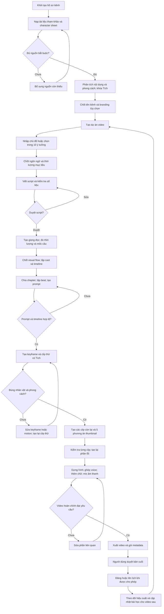

# Flow xây dựng hệ thống sản xuất video Tích Finance

Tài liệu này tổng hợp quy trình từ Script làm video.docx, STICKMAN FINANCE MODULE PDF.pdf và TICH_Finance_Animation_Engine_v2.0_VI.md. Các bước tạo giọng đọc, thực thi tạo ảnh và clip, dựng, xuất bản và phản hồi hiệu suất là phần đề xuất bổ sung để hoàn thiện hệ thống. Đây là thiết kế quy trình, chưa phải hệ thống đã triển khai.

## 1. Flow tổng thể

## 2. Tách thiết lập kênh khỏi sản xuất từng video

Thiết lập một lần: tên kênh, định vị, nhóm khán giả, ngôn ngữ mặc định, branding, character sheet Tích, STYLE ANCHOR, quy tắc animation, thư viện đạo cụ và nguyên tắc thumbnail. Khi làm video mới, dùng lại hồ sơ đã duyệt; không chạy lại naming hoặc thiết kế lại Tích. Nếu đổi nhận diện, tạo phiên bản hồ sơ kênh mới và chỉ áp dụng cho các dự án được chọn.

Mỗi video có chủ đề, script, nguồn số liệu, voice, cast phụ, visual flow, timeline, prompts, ảnh, clip, thumbnail, bản dựng và trạng thái duyệt riêng.

## 3. Quy trình chi tiết và đầu ra

| Bước | Dữ liệu đầu vào | Xử lý | Đầu ra và điều kiện đi tiếp |
|---|---|---|---|
| 01 Nạp nguồn | PDF tham khảo, character sheet, yêu cầu kênh | Đọc văn bản và hình ảnh; ghi nguồn và dữ liệu thiếu | Hồ sơ nguồn; chưa có character sheet thì chưa khóa nhận diện Tích |
| 02 Phân tích | Hồ sơ nguồn | Trích writing, visual, animation, thumbnail và prop DNA; đánh dấu phần chỉ là suy luận | Hồ sơ phong cách đã duyệt |
| 03 Khóa kênh | Hồ sơ phong cách, tên có sẵn hoặc tên đề xuất | Chốt tên; branding có thể bỏ qua | Hồ sơ kênh dùng lại cho nhiều video |
| 04 Chọn chủ đề | Chủ đề tự nhập hoặc 10 ý tưởng | Chốt góc nhìn, đối tượng, ngôn ngữ và thời lượng | Brief video |
| 05 Viết script | Brief, writing DNA, nguồn dữ kiện | Viết narration; kiểm tra claim, phép tính, sự nguyên bản và nhịp kể | Script đã duyệt, phiên bản cố định |
| 06 Tạo voice | Script đã duyệt, cấu hình giọng | Tạo hoặc nhận bản thu; kiểm tra đọc sai; đo audio và mốc câu | Voice đã duyệt và timeline narration |
| 07 Chốt visual flow | Script, voice, ý tưởng cảnh người dùng | Giữ các beat người dùng nêu; bổ sung khoảng trống; lập cast phụ và đạo cụ | Storyboard theo thời gian và danh sách reference cần có |
| 08 Tạo chapter prompts | Storyboard, clip ceiling, hồ sơ kênh | Chia chapter; lập beat; nhúng lock; tách overlay và chỉ dẫn âm thanh | Prompt đầy đủ cho từng chapter; timeline không hở hoặc chồng |
| 09 Clip thử | Prompt đại diện có Tích, reference | Tạo scene still nếu cần rồi animate; kiểm tra identity và motion | Clip thử đạt yêu cầu trước khi sản xuất hàng loạt |
| 10 Sản xuất assets | Bộ prompts đã duyệt | Tạo clip theo hàng đợi; lưu reference, phiên bản, chi phí và lỗi | Bộ clip được kiểm tra; chỉ chạy lại phần lỗi |
| 11 Thumbnail | Script khóa, thumbnail DNA | Tạo 5 phương án với ít nhất 3 mode; thêm chữ ở khâu dựng | Bộ thumbnail; chọn phương án dùng cho bản xuất |
| 12 Dựng video | Voice, clip, overlay, SFX, ambient, music | Ghép timeline; căn hình với lời; chèn số liệu và chữ chính xác | Bản xem trước đầy đủ |
| 13 Kiểm tra bản cuối | Bản dựng và script đã duyệt | Kiểm tra nội dung, nhân vật, continuity, âm thanh, phụ đề và thông số xuất | Bản cuối được người dùng duyệt |
| 14 Xuất và đăng | Video cuối, thumbnail, metadata | Xuất file; đăng/lên lịch chỉ khi được cho phép | Gói bàn giao hoặc video đã đăng |
| 15 Phản hồi | Dữ liệu hiệu suất nếu được cung cấp hoặc kết nối | Xem CTR, retention và điểm rơi; lưu bài học có bằng chứng | Brief cải tiến cho video sau |

## 4. Các quy tắc cần giữ từ Engine v2.0

- Character sheet là nguồn chính cho nhận diện Tích; PDF tham khảo cung cấp nguyên tắc kể chuyện và hình ảnh. Không lấy mascot nguồn để thay Tích.
- Giữ tóc, đầu trắng lớn, khăn đỏ, tỷ lệ đầu/thân, mặt tối giản và tay chân mảnh. Không tạo Tích mới theo từng video.
- Narration mặc định tiếng Việt; prompt ảnh/video mặc định tiếng Anh; chữ overlay đưa riêng.
- Mọi prompt có Tích chứa đầy đủ CHARACTER LOCK; mọi chapter chứa STYLE ANCHOR, PROP PALETTE, beats và negative prompt.
- Character sheet dùng làm reference nhận diện; scene still dùng làm first frame nếu cần. Hai vai trò này phải tách rõ trong dữ liệu gửi model.
- Không đưa phần script reference vào prompt gửi video model. Editor nhận phần lời và mốc thời gian để căn dựng.
- Chữ, nhãn biểu đồ và con số chính xác được dựng bằng overlay; không yêu cầu model video tự viết.
- Mỗi beat tối đa một camera move; nếu phong cách đã khóa camera tĩnh thì dùng framing và cut để đổi nhịp.
- Dùng match-cut giữa các chapter; không thêm thời lượng thừa vào chapter cuối.
- Giữ 5 phương án thumbnail với ít nhất 3 mode; không tạo claim hoặc con số ngoài script.
- Quy tắc 4–5 beats cho clip 10 giây và 5–7 beats cho clip 15 giây là mục tiêu nhịp cảnh. Chapter cuối ngắn phải giảm số beats cho phù hợp.

## 5. Điều chỉnh cần thiết khi chuyển prompt thành hệ thống

### Thời lượng lấy từ voice đã duyệt

Số từ chỉ dùng để dự toán script. Transcript không có thời lượng audio thì không đủ để tính words per second. Mặc định 2.6 wps trong tài liệu là giá trị dự toán cần kiểm chứng, đặc biệt với tiếng Việt vì cách đếm từ bằng khoảng trắng không tương đương tiếng Anh.

Sau khi có voice, lấy thời lượng audio làm chuẩn. Với tổng thời lượng T và clip ceiling C, số chapter tối thiểu là ceil(T/C). Chapter cuối có thời lượng T - C × (N - 1) khi các chapter trước dùng đúng C. Nếu các chapter ngắn hơn C để bám ranh giới câu, tính lại tổng thời lượng từng chapter và số chapter thực tế.

Không cắt câu một cách máy móc theo mốc 10 hoặc 15 giây. Ưu tiên mốc câu và ý nghĩa, sau đó kiểm tra mọi chapter đều nằm trong ceiling. Khả năng tạo clip ngắn hoặc cắt trim phụ thuộc công cụ được chọn; hệ thống phải kiểm tra khả năng đó trước khi chạy.

### Chốt cast theo hai lượt

Đọc script để lập cast dự kiến trước visual flow, tương ứng STATE 5. Sau khi có storyboard/chapter, xác nhận nhân vật nào thực sự xuất hiện nhiều lần để tạo reference. Điều này tránh yêu cầu biết số chapter trước khi chapter được lập.

### Lưu trạng thái thay cho phụ thuộc keyword

Các từ go, next, CONTINUE và done là thao tác giao diện của engine. Backend cần lưu trạng thái và kết quả duyệt, không coi một tin nhắn có keyword là bằng chứng mọi đầu vào đã đủ. Branding và ý tưởng là nhánh tùy chọn; bước bắt buộc chỉ được đi tiếp khi có dữ liệu hợp lệ.

### Sửa một phần thì chỉ làm lại phần bị ảnh hưởng

Sửa script: đánh dấu voice, timeline, prompts, clip và bản dựng liên quan là cần cập nhật. Sửa một prompt: chỉ làm lại assets chapter đó và kiểm tra hai điểm nối với chapter liền kề. Sửa thumbnail: không làm lại video. Đổi character sheet hoặc style: đánh dấu mọi asset phụ thuộc phiên bản cũ để người dùng chọn tái tạo.

### Không đồng nhất prompt với asset hoàn chỉnh

STATE 7 trả prompt; chưa có nghĩa clip đã được tạo. STATE 8 trả phương án thumbnail; chưa có nghĩa ảnh đã tồn tại. Tách trạng thái prompt_ready, asset_generated và asset_approved để giao diện phản ánh đúng tiến độ.

## 6. Các module cần xây

| Module | Trách nhiệm |
|---|---|
| Quản lý kênh | Lưu hồ sơ kênh, branding, character reference và phiên bản phong cách |
| Quản lý nguồn | Nhận tài liệu, trích xuất text/image, lưu provenance và dữ liệu thiếu |
| Điều phối workflow | Quản lý state, nhánh tùy chọn, điểm duyệt và quan hệ phụ thuộc |
| Nội dung | Sinh ý tưởng, script và danh sách claim cần kiểm chứng |
| Voice và timeline | Nhận/tạo voice, đo thời lượng và căn mốc lời |
| Storyboard và prompts | Lập cast, chapter, beat, overlay và prompt đầy đủ |
| Kết nối công cụ tạo media | Chuyển dữ liệu chuẩn sang yêu cầu của từng công cụ ảnh/video/voice |
| Hàng đợi công việc | Chạy job, retry có giới hạn, tránh tạo trùng, ghi chi phí và trạng thái lỗi |
| Thư viện assets | Lưu reference, keyframe, clip, thumbnail và phiên bản đã duyệt |
| Dựng và xuất | Tạo timeline dựng, ghép audio, overlay, phụ đề và file cuối |
| Kiểm tra và phê duyệt | Kiểm tra tự động về dữ liệu/thời gian; cho người dùng xem và duyệt chất lượng hình/âm |
| Xuất bản và hiệu suất | Bàn giao hoặc đăng khi được cho phép; nhận dữ liệu hiệu suất |

Chưa chốt nhà cung cấp, framework hoặc khả năng API của công cụ cụ thể. Những lựa chọn đó cần được xác minh khi bắt đầu triển khai.

## 7. Dữ liệu tối thiểu cần lưu

- Channel: channel_id, tên, định vị, audience, ngôn ngữ, style_version, character_reference_id, branding.
- Reference: reference_id, file, loại, nguồn, trạng thái đọc và xác nhận.
- VideoProject: project_id, channel_id, brief, thời lượng mục tiêu, trạng thái, phiên bản script và voice đang dùng.
- Script: script_id, version, narration, cách đếm từ, claims, nguồn, trạng thái duyệt.
- Voice: voice_id, script_version, file, duration, sentence_timestamps, trạng thái duyệt.
- Chapter: chapter_id, thứ tự, start, end, lời được cover, beats, cast, props, overlays, handoff.
- Prompt: prompt_id, chapter_id, phiên bản lock/style, prompt gửi model và editor notes riêng.
- Asset: asset_id, loại, chapter_id nếu có, file, input_version, generation_job_id, trạng thái QA.
- Job: job_id, loại thao tác, inputs, trạng thái, số lần thử, lỗi, thời gian, chi phí nếu công cụ cung cấp.
- Approval: đối tượng, phiên bản, người duyệt, kết quả, thời gian và ghi chú sửa.
- Export: export_id, timeline_version, video_file, thumbnail_file, metadata, trạng thái bàn giao/đăng.

## 8. Thứ tự triển khai

1. Xây hồ sơ kênh, thư viện reference và trạng thái dự án; nhập dữ liệu từ ba tài liệu.
2. Xây luồng chủ đề → script → duyệt; lưu phiên bản và nguồn claim.
3. Xây voice → timestamp → storyboard → chapter → prompt; cho phép nhập voice thủ công trước.
4. Xây xuất gói prompt và nhập assets thủ công để chạy được một video xuyên suốt.
5. Thêm kết nối tạo ảnh/video; clip thử bắt buộc; retry từng chapter và giới hạn chi phí.
6. Thêm dựng, overlay, audio và kiểm tra bản xuất.
7. Thêm xuất bản có duyệt và phản hồi hiệu suất sau khi quy trình sản xuất ổn định.

Mốc nghiệm thu đầu tiên: sản xuất được một video hoàn chỉnh từ brief, giữ Tích nhất quán, hình khớp lời, thumbnail đúng script và xuất được file cuối. Kết nối tự động thêm dần sau mốc này.

## 9. Dữ liệu còn thiếu cho việc chạy thật

Chưa có character sheet riêng của Tích trong ba file được cung cấp. PDF chứa transcript và tài liệu diễn giải phong cách, nhưng ảnh tham khảo cần được kiểm tra trực quan trước khi khóa visual DNA; mô tả text không đủ để xác nhận toàn bộ hình ảnh hoặc hành vi animation. Nhịp camera, motion và wps cần video/audio hoặc thông tin thời lượng có thể kiểm chứng. Cần chốt công cụ sản xuất, giọng đọc và định dạng đầu ra khi triển khai; những phần này không cản trở việc hoàn thiện flow kiến trúc.
